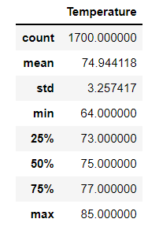
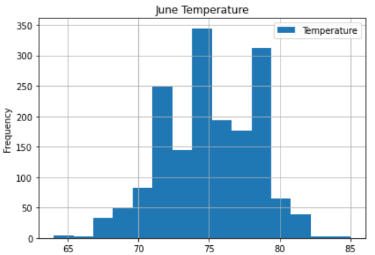
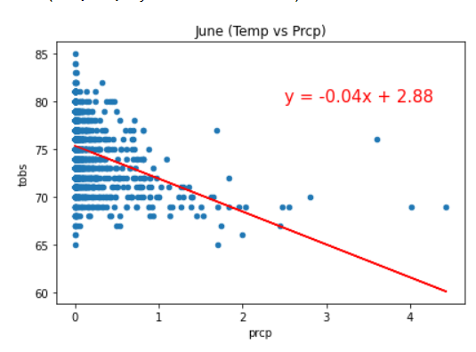
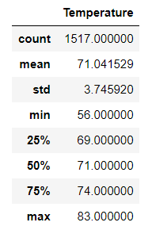
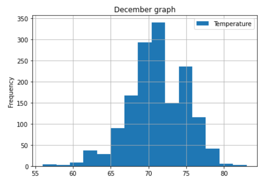

# SurfsUp

# Introduction 
Avy wants to put a surf shop and a Ice cream shop at the same time and he wants to determine if it´s going to be sustainable all year round 

# Objective 
- See tendencies in temperature between 2 of the most out range months (June and December)
- Describe minimum, maximum and mean temperature trough the years
- Look for relations between temperature and rain to see how profitable will it will be

# Metodology and materials
- SqlAlchemy v.1.4.32
- pandas v.1.3.5
- jupyter notebook v 6.4.8

First we imported a sql base into jupyter notebook with SqlAlchemy, after that we extracted the values we desired and created a dataframe, after that we only used the
describe() function from pandas. 
After that some histograms where created to vizualise the frequency of temperature and see how viable the shop was, and a bonus was created in form of a graph with 
temperature and precipitation to see how common raining was. 

# Results

In the first image (fig 1.) we can see a table describing the temperature behaviour for the month of june, it ranges from 64 °F up to 85°F with a mean of 71°F, themean
is closer to the minimum but it´s still a good temperature to go to the beach and start surfing and maybe get some ice cream. 

We can see that the temperature had something similar to a gaussian bell with some peaks in the temperature 73 °F, 74°F and 86°F all of them being good temperature to go
the beach. And to finish with june we have the figure 3 that represent the correlation between temperature and precpitation, we can observe that with less temperature
there is a higher probability for it to rain, the peak is at 68 °F so if we compare it with the figure 2 we can see that it is not a common temperature so it´s save to
assume that june is a good month to put a surf shop

For the month of december we didn´t have a lot of changes, the in the maximum (83°F) and the mean (71°F), but for the minimum it dropped 10°F up to 56°F, almost all
the data was located between 73°F to 77°F making it the perfect weather to be in

In the histogram we can see that it had a almost like simetric distribution but a little bit skewed to the right 

If we compare it with precipitation there we have a special sighting, in the more regular temperature (70°F to 73°F) there is a more likely probability for it to rain
so for surfing this might not be a problem but for ice cream it may decrease the number of sells

# Conclusion

- June has a higher temperature and mean (as expected)
- The precipitation may affect more in december than in june
- The temperature in june is more spread than december
